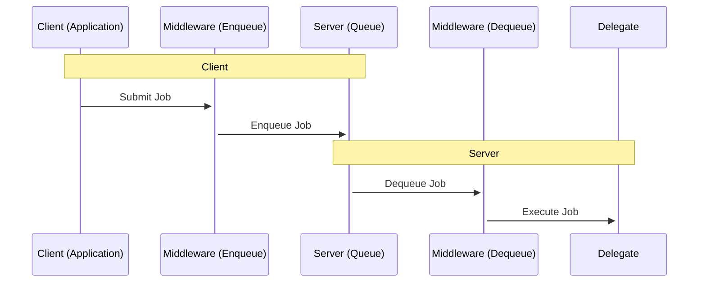

# Getting Started

This guide gives you an overview of the `async-job` gem and explains the core concepts.

## Installation

Add the gem to your project:

``` shell
$ bundle add async-job
```

## Core Concepts

`async-job` is a library for building asynchronous job queues.

- Several included {ruby Async::Job::Queue} implementations for enqueueing and running jobs.
- Several supported {ruby Async::Job::Coder} implementations for encoding and decoding job payloads.
- A {ruby Async::Job::Generic} class which describes the minimum required job interface.

The `async-job` library provides a framework for enqueueing and dequeuing jobs, without prescribing how jobs are executed. It is expected that you would use this library to wrap existing schemas for job definition and execution. This design allows you to use `async-job` in a wide variety of applications, without the need for cumbersome wrappers.

## Usage

In general, a job processing system pipeline comprises two parts: a client that submits jobs into a queue, and a server that reads jobs out of a queue and processes them.



You can use {ruby Async::Job::Builder} to create a pipeline that includes both the producer and consumer sides of a queue:

```ruby
require 'async'
require 'async/job'
require 'async/job/processor/inline'

# This is how we execute a job from the queue:
executor = proc do |job|
	puts "Processing job: #{job}"
end

# Create a simple inline pipeline:
pipeline = Async::Job::Builder.build(executor) do
	# We are going to use an inline processor which processes the job in the background using Async{}:
	enqueue Async::Job::Processor::Inline
end

# Enqueue a job:
Async do
	pipeline.call("My job")
	# Prints "Processing job: My job"
end
```

## Rails Integration

You can use `async-job` with Rails's ActiveJob framework by using the `async-job-adapter-active_job` gem. This allows you to use `async-job` as a backend for ActiveJob, which is useful for integrating with existing Rails applications.

### Redis Processor

The `async-job-processor-redis` gem provides a Redis-based processor for `async-job`. This processor is similar to Sidekiq, and is designed to provide a similar interface and feature set.
